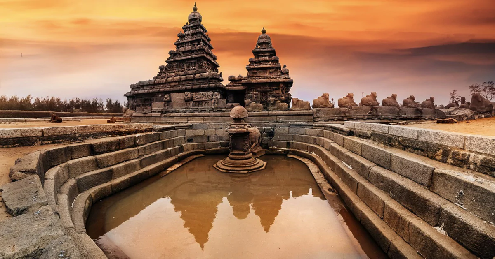
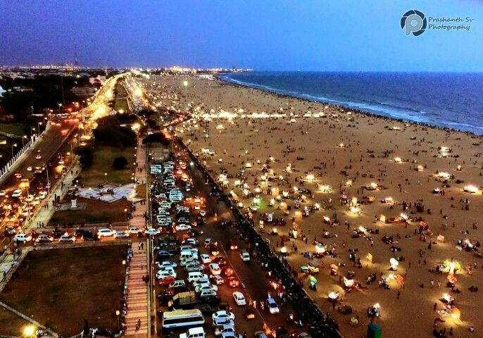
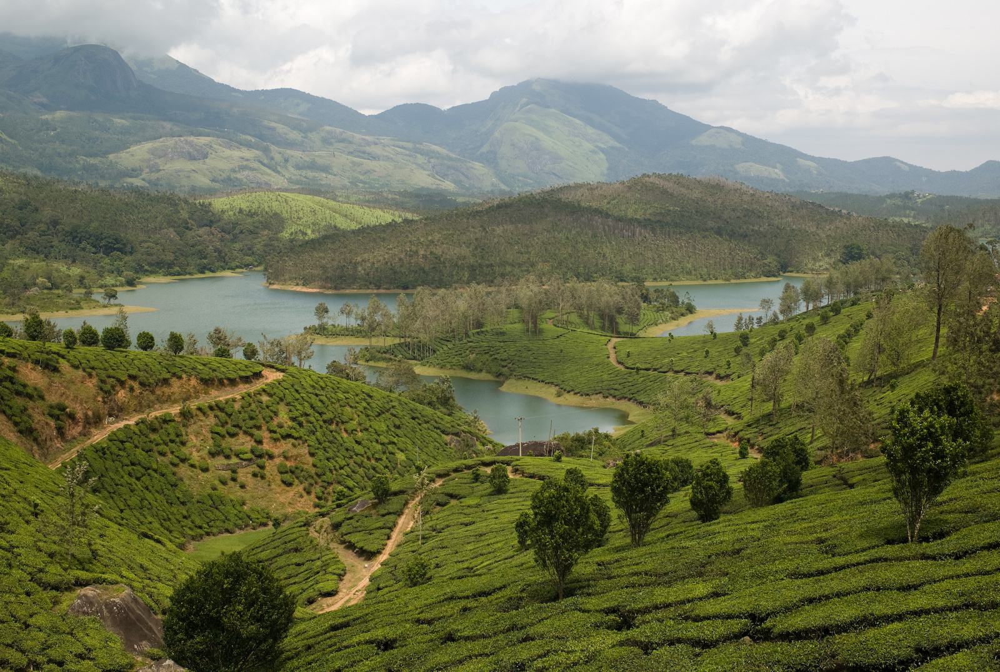

# assignment2-sanagala
# Gahana Swetha Sanagala
##### mutton curry
my favourite dish is mutton curry which is popular curry in india in southern states which will be served in the combination of rice and i love with the
**combination of having along with tortilas** 

__________________________________________
# ORDERED LIST
1. Go to the store
2. Buy food
   1. Rice
   2. Drink
   3. Tea
   4. Bread
   5. Milk
   6. Curd
3. Come home
4. After coming home

# UNORDERED LIST
*  Go to the store
*  Buy food
   * mutton
   * chicken
   * beef
   * fish
   * eggs
   * fruits
* Come home    

--------------------------------------------------------
# One interesting place to visit in india is "CHENNAI"
 
 Chennai, on the Bay of Bengal in eastern india, is the captial of the state of Tami Nandu.It is famous as the biggiest cultural and economic center down south,chennai was earlier know as Madras.The city houses several Hindu temples,churches and museums,froms its white-sand beaches to mouth-watering seafood,chennai is known as the "GATE OF SOUTH INDIA".

-----------------------------------------------------------

|  Location    |   Number of hours |  Amount Of Money |
|--------------|-------------------|----------------  |
| Mahabalipuram|       3 hours     |   200$           |
| Marina Beach |       5 hours     |     50$          |
| Pondicherry  |       6 hours     |     100$         |
| Pichavaram   |       4 hours     |     300$         |
| Yelagiri     |       9 hours     |     250$         |
|              |                   |                  |

---------------------------------------------------------

# Quotes

> "Spread love everywhere you go.Let no one ever come to you without leaving happier.*** Mother Teresa ***
> "Tell me and I forget. Teach me and I remember. Involve me and I learn." *** Benjamin Franklin ***
> ""You will face many defeats in life, but never let yourself be defeated." *** Maya Angelou ***

---------------------------------------------------------

# Code Fencing 

> Z++ allows for the definition of classes, and the relation of classes through inheritance, association, or aggregation. The primary construct of Z++ is a class. A Z++ class consists of a number of clauses which are optional.
[click here to know about Z++](https://en.wikipedia.org/wiki/List_of_programming_languages)

...

CLASS ClassName
  [OWNS List_of_attributes]
  [FUNCTIONS constant_definitions]
  [TYPE type_declaration]
  [ENTENDS list_of_super_classes]
  [OPERATIONS list_of_state_change_operations_definitions]
  [RETURNS list_of_query_operations_definitions]
  [ACTIONS all_operations_declarations]
  [INVARIANT predicates]
  [HISTORY RTL_predicates]
END CLASS

...

***

----------------------------------------------------------

# Images of the placess to visit in Chennai

|  Location    |   Number of hours |  Amount Of Money |             Images                      |        
|--------------|-------------------|------------------|----------------------------------------- |
| Mahabalipuram|       3 hours     |   200$           |       |
| Marina Beach |       5 hours     |     50$          | |
| Pondicherry  |       6 hours     |     100$         |            |
| Pichavaram   |       4 hours     |     300$         |             |
| Yelagiri     |       9 hours     |     250$         |                 |
|              |                   |                  |                                          |